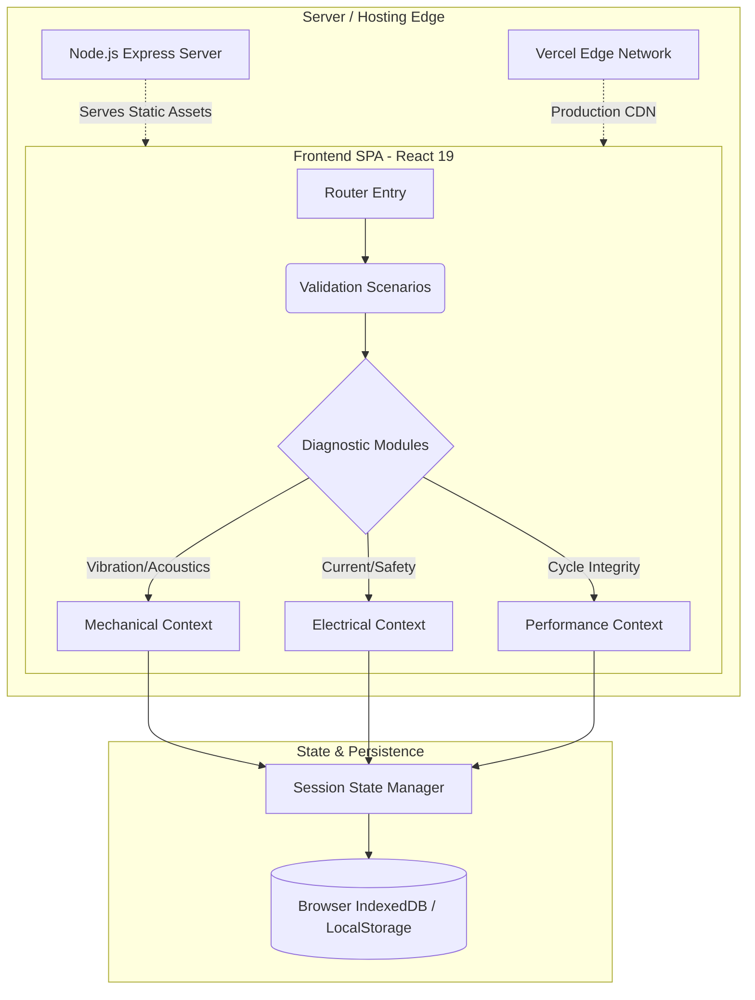
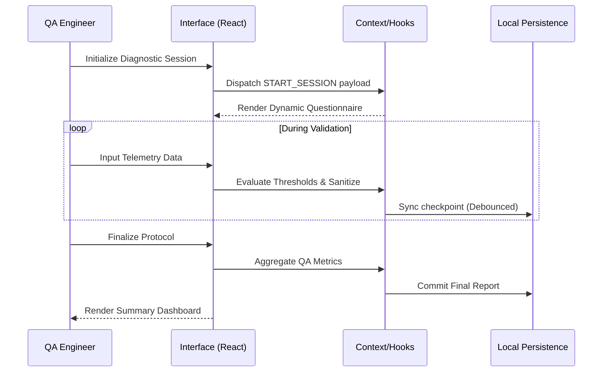

# WashLab - Quality Assurance Diagnostics System


WashLab is an interactive, telemetry-driven diagnostic interface engineered for QA teams. It standardizes testing protocols, localizes state execution, and provides real-time feedback for electromechanical appliance validation.

## System Architecture

The application implements a decoupled, client-heavy architecture, utilizing `wouter` for lightweight client-side routing and Radix primitives for an accessible, unstyled component foundation. The UI state is encapsulated within context providers to isolate diagnostic sessions.

### Architecture Overview



### Component Interaction Sequence



## Repository Structure

```text
.
├── client/
│   ├── public/          # Static assets & standalone scripts
│   └── src/
│       ├── components/  # Radix UI implementations & domain components
│       ├── contexts/    # Global state management
│       ├── hooks/       # Custom React hooks (useMobile, usePersistFn)
│       ├── pages/       # Route-level components
│       └── lib/         # Utility functions (Tailwind merge, formatting)
├── server/
│   └── index.ts         # Express boilerplate for static serving
├── shared/
│   └── const.ts         # Cross-boundary types and constants
└── vite.config.ts       # Build configuration & path aliases
```

## Author

**Ziad Emad** (@ziademad02153)
Architected and engineered this interactive diagnostic system to streamline QA workflows.
